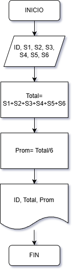
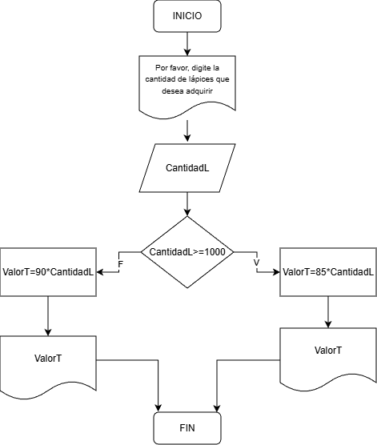

# **Actividad #2**
### **Ejercicio 2**
- Construye un algoritmo que, al recibir como datos el ID del empleado y los seis primeros sueldos del año, calcule el ingreso total semestral y el promedio mensual, e imprima el ID del empleado, el ingreso total y el promedio mensual.

**Datos de Entrada**  
| **Nombre**  |  **Descripción** |
|---|---|
| ID  | Identificador del empleado (numérico)  |
| S1, S2, S3, S4, S5, S6  | Sueldo de los primeros 6 meses (numérico)  |

**Datos de Salida** 

|  **Nombre** | **Descripción** |
|---|---|
| Prom  | Promedio Mensual (numérico)  |
|  Total |  Total Semestral (numérico) |
|  ID |   |

**Pseudocódigo** 
```

Inicio  

Leer ID, S1, S2, S3, S4, S5 y S6  
Total= S1+S2+S3+S4+S5+S6  
Prom= Total/6  
Mostrar: ID, Total y Prom  

Fin

```

**Diagrama de Flujo**  


Ejercicios

## **Estructuras selectivas: Involucran la toma de decisiones.**

### **Ejercicios**
**1.** Realice un algoritmo para determinar cuánto se debe pagar por equis cantidad de lápices considerando que si son 1000 o más el costo es de $85 cada uno; de lo contrario, el precio es de $90. Represéntelo con el pseudocódigo y el diagrama de flujo.   

 **Datos de Entrada**  

| **Nombre** | **Descripción** |
|---|---|
| CantidadL   |  Cantidad de lápices a comprar (numérico) |

**Datos de Salida**

| **Nombre** | **Descripción** |
|---|---|
|ValorT| Valor Total a pagar (numérico)|

**Datos Intermedios**

| **Nombre** | **Descripción** |
|---|---|
```
Inicio
Mostrar: "Por favor, digite la cantidad de lápices que desea adquirir"
Leer CantidadL
Si CantidadL >= 1000

    ValorT= 85*CantidadL

        Si no

        ValorT= 90*CantidadL

Fin Si

Mostrar: ValorT
Fin
```
**Diagrama de Flujo**  



