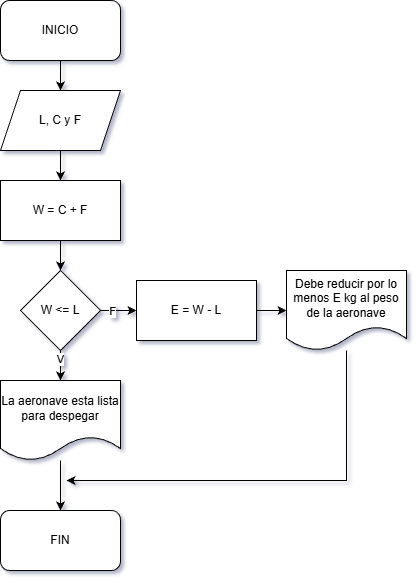
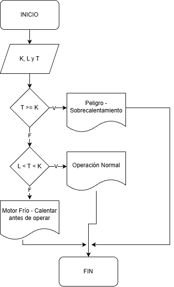

# **Taller de Algoritmos** 🚀


1. **Verificación de peso de despegue**
    
    En una pista de pruebas de aeronaves, el sistema debe verificar si el peso total de la aeronave, incluyendo combustible y carga, supera el límite máximo permitido para el despegue. Dependiendo del resultado, el sistema deberá indicar si la aeronave está lista para despegar o si debe reducir carga o combustible.

    **Datos de Entrada**

    | Nombre | Descripción |
    |---|---|
    |L | límite máximo permitido en kg(numérico)|
    |C | Carga de la aeronave en kg(numérico)
    |F | Combustible de la aeronave en kg(numérico)

    **Datos Intermedios**
    |Nombre | Descripción |
    |---|---|
    |W | Peso total de la aeronave en kg (numérico)

    **Datos de Salida**
    | Nombre | Descripción |
    |---|---|
    |E | Excedente de peso en kg (numérico)|

    **Diagrama de Flujo**  
      

 2. **Control de temperatura del motor**  
    Durante una inspección de rutina, se mide la temperatura de un motor de turbina. Si la temperatura es mayor a un valor crítico, se debe indicar "Peligro: sobrecalentamiento". Si está dentro del rango seguro, indicar "Operación normal". Si es demasiado baja, indicar "Motor frío – Calentar antes de operar".

    **Datos de Entrada**
    | Nombre | Descripción |
    |---|---|
    |K | Temperatura Critica|
    |L | Temperatura Mínima|
    | T | Temperatura Actual |
    ```
    Inicio  

    Leer K, L y T  

    Si T >= K entonces 

        Mostrar: Peligro - Sobrecalentamiento  

        Sino  

        Si L < T < K  

            Mostrar: Operación normal

            Sino

            Mostrar: Motor frío - Calentar antes de operar

        Fin Si

    Fin Si

    Fin
    ```
    **Diagrama de Flujo**  
    
3. **Registro de altitudes de vuelo**
    
    Un sistema debe registrar la altitud de vuelo cada 10 minutos durante una hora y mostrar todas las mediciones al final.

4. **Control de combustible en pruebas**
    
    Durante un ensayo en banco de un motor a reacción, se mide el nivel de combustible cada minuto y se detiene el registro cuando el combustible baja del 10%. Mostrar el tiempo total de operación antes de llegar a ese punto.

    **Datos de Entrada**
    
    | Nombre | Descripción |
    |---|---|
    |F | Nivel de combustible actual |
    |C | Tiempo Total de Operación |
    |V | Combustible Máximo del Tanque |


    